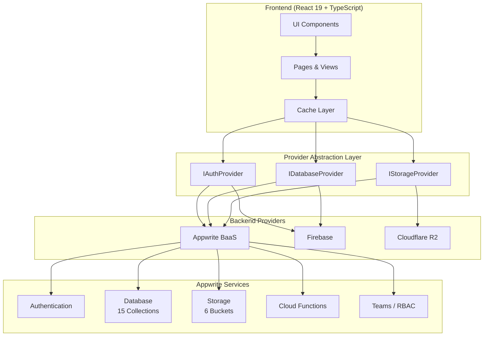
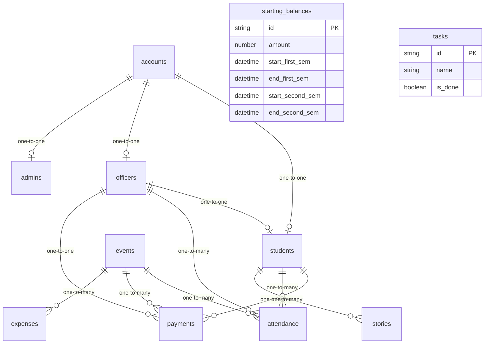

# SPECS Organization Management System

   

A centralized web application built with **React 19**, **TypeScript**, **TailwindCSS**, and **Appwrite** to serve as the central hub for the **Society of Programmers and Enthusiasts in Computer Science (SPECS)**.

---

## Problem Statement

Before this platform, managing the organization was a manual and fragmented process. The executive board faced several key challenges:
* **Disorganized Data:** Student lists, payment records, and event attendance were scattered across multiple spreadsheets and paper logs, making data retrieval difficult.
* **File Fragmentation:** Important documents and learning resources were shared via ephemeral messaging apps or broken drive links, leading to resource loss.
* **Lack of Transparency:** Students had no real-time way to check their payment status or view upcoming events without directly contacting an officer.

## The Solution

This **Student & Admin Portal** acts as the "Single Source of Truth" for the organization. It digitizes the workflow by:
1. **Centralizing Records:** A unified relational database with `accounts` as the central hub linking to `students`, `officers`, and `admins`.
2. **Automating Access:** Role-based dashboards ensure officers have the tools they need while students access only what is relevant.
3. **Streamlining Resources:** A dedicated file repository and resources page ensures educational materials are always accessible.

---

## System Architecture



## Database Entity Relationships



---

## Design Decisions

In building this application, specific architectural and technical choices were made to balance performance, learning curve, and rapid deployment:

### 1. React 19 & TypeScript
* **Decision:** We migrated from Vanilla JavaScript to React 19 and TypeScript.
* **Reasoning:** As the application grew in size (14+ admin views, shared components, complex state management), Vanilla JS became hard to scale. React provides a component-driven architecture for high reusability, and TypeScript ensures compile-time type safety, minimizing runtime exceptions and ReferenceErrors.

### 2. Appwrite BaaS
* **Decision:** We utilized Appwrite for the backend instead of building a custom REST API with Node/Express.
* **Reasoning:** As a student-led project with tight deadlines, we needed a secure, production-ready backend immediately. Appwrite handles Authentication, Database (CRUD), File Storage, Cloud Functions, and Teams out-of-the-box, allowing us to focus 100% on the frontend logic and user experience.

### 3. TailwindCSS for Styling
* **Decision:** Replaced Plain CSS/SCSS with TailwindCSS.
* **Reasoning:** TailwindCSS enables rapid prototyping and styling consistency through a robust utility-first system. It simplifies layout design, responsive configurations, and custom animations, while keeping CSS output extremely small through purge utilities.

### 4. Multi-Provider Architecture
* **Decision:** Built an abstraction layer with provider interfaces for Auth, Database, and Storage.
* **Reasoning:** To allow swapping backend services (e.g., Firebase for auth, Cloudflare R2 for storage) without changing application code. Each provider implements a common interface.

---

## Features

### General
- **User Authentication:** Secure login/signup with university email validation, verification, and session expiry detection.
- **Role-Based Access:** Separated dashboards and permissions for `students`, `officers`, and `admins` with team-based access control via Appwrite Teams.
- **Public Landing Page (7 routes):** Home, Events, About Us, Resources, Stories, Story Detail, Login/Signup.
- **Volunteer System:** Full lifecycle — students request volunteer status, officers approve/reject, volunteers create posts, and can request to leave (`none` → `pending` → `approved`/`rejected`, plus `backout_pending`).
- **Stories & Highlights:** Volunteer-authored blog posts with officer/admin approval workflow (`officerApproval` + `adminApproval`), published to the public landing page.
- **QR Code Scanner:** Fullscreen scanner for quick student lookup and event check-in via `html5-qrcode`.
- **PDF Export:** Report generation and printing with `jspdf` and `html2canvas`.
- **Centralized Caching:** localStorage-based image and data caches with TTL, LRU eviction, stale-while-revalidate, request deduplication, and tag-based invalidation.
- **Structured Error Handling:** Typed `ApiError` classes with error code enums and Appwrite error mapping.
- **Toast Notifications:** Custom toast system with 4 types (success, error, warning, info), auto-dismiss, progress bars, and pause-on-hover.
- **Confirmation Modals:** Custom reusable `ConfirmModal` component with 5 visual variants.

### Student Dashboard (5 views)
- **Event Calendar:** View upcoming and past events.
- **Payment Tracking:** See pending and completed payments with payment card summaries.
- **Attendance History:** View personal event attendance records.
- **Profile Settings:** Update personal info, request volunteer status, or request to leave the volunteer program.
- **Volunteer Posts:** Create, edit, and delete blog posts with cover images (for approved volunteers only).

### Officer Dashboard (8 views)
- **Finance Overview:** Track revenue and expenses with charts, including starting balance configuration.
- **File Sharing:** Browse and manage shared documents.
- **Event Calendar:** View and manage upcoming events.
- **Student Directory:** Filterable, paginated list of students with verification controls.
- **Payment Management:** View and manage student payments with payment card components.
- **Volunteer Management:** Approve or reject volunteer requests and backout requests with card-based UI.
- **Story Approval:** Review, approve/reject, edit, and delete volunteer posts before publication.
- **Settings:** Manage officer profile, schedule, and picture.

### Admin Panel (13 views)
- **Dashboard Stats:** At-a-glance overview with Chart.js / Recharts visualizations and animated counters.
- **Account Management:** Approve, verify, deactivate/reactivate, and delete accounts. Promote students to officers or demote via Appwrite Cloud Functions. CSV export.
- **Event Management:** A timeline view to add, edit, and delete events with related links and collaborators.
- **Attendance Management:** Event-based attendance tracking with student search autocomplete and non-member support.
- **Payment Management:** Assign and manage payments (individually or by bulk) with support for non-BSCS students.
- **Finance Overview:** Revenue and expense tracking with charts and starting balance management per school year.
- **Student Directory:** Comprehensive student management.
- **File Management:** View and manage all uploaded files.
- **Volunteer Management:** Full volunteer lifecycle management.
- **Stories Management:** Full CRUD, approval workflow, filtering by status, and statistics.
- **Task Management:** Create and track admin/officer tasks with completion state.
- **Announcements:** Draft composition with recipient targeting (all/students/officers), copy-to-clipboard, and open-in-email-client.
- **Settings:** Admin profile and preferences.

---

## Tech Stack

| Category | Technology | Version |
|----------|-----------|---------|
| **Frontend** | React 19, TypeScript, TailwindCSS v3 | — |
| **Icons** | Lucide React, Bootstrap Icons (SVG) | ^1.22.0 / ^1.13.1 |
| **Charts** | Chart.js, Recharts | ^4.5.0 / ^3.9.0 |
| **PDF / Print** | jspdf, html2canvas | ^4.2.1 / ^1.4.1 |
| **QR Scanner** | html5-qrcode | ^2.3.8 |
| **Backend** | Appwrite Cloud (BaaS) | SDK ^18.1.1 |
| **Server SDK** | node-appwrite (Cloud Functions) | ^17.0.0 |
| **Build Tool** | Vite | 7.1.11 |
| **Testing** | Vitest, jsdom, @testing-library/dom, @testing-library/user-event | ^2.1.8 |
| **Coverage** | @vitest/coverage-v8 | ^2.1.8 |
| **Quality** | Unlighthouse (Performance & SEO Scanning) | ^0.17.2 |

---

## Architecture

### Centralized API Layer

All backend operations go through a structured `api` object in `shared/api.ts`:

| Namespace | Methods |
|-----------|---------|
| `api.events` | `list()`, `get()`, `create()`, `update()`, `delete()`, `markEnded()` |
| `api.payments` | `list()`, `listForStudent()`, `create()`, `update()`, `delete()`, `markPaid()` |
| `api.attendance` | `listForStudent()`, `listForEvent()`, `create()`, `delete()` |
| `api.users` | `getCurrent()`, `getAccount()`, `getStudentProfile()`, `listStudents()` |
| `api.students` | `get()`, `update()` |
| `api.stories` | `list()`, `get()`, `create()`, `update()`, `delete()`, `approve()`, `getByStudent()`, `getPending()` |
| `api.officers` | `list()`, `assignStudent()`, `removeStudent()` |
| `api.admins` | `getCurrent()` |
| `api.tasks` | `list()`, `create()`, `update()`, `delete()` |
| `api.files` | `getFilePreview()`, `uploadEventImage()`, `deleteEventImage()`, `upload()`, `listFiles()` |
| `api.finance` | `getOverview()` (revenue, expenses, starting balances) |
| `api.startingBalances` | `list()`, `upsert()` |
| `api.dashboard` | `getStats()` |
| `api.metadata` | `getCollections()`, `getBucketId()` |
| `api.cache` | `clearAll()`, `clearByPattern()`, `clearKey()`, `getStats()` |
| `cachedApi` | Cached wrappers for frequently used read operations with configurable TTL |

### Two-Tier Caching System

```
Request → cache.get(key)
  ├── Hit (fresh) → return data
  ├── Hit (stale) → return stale + background revalidate
  └── Miss → fetch → store → return
                └── deduplication: concurrent same-key requests share one fetch
```

Cache features:
- **Data cache** (`dataCache`): TTL-based with LRU eviction, tag-based invalidation
- **Image cache** (`imageCache`): Separate cache for binary/image data
- **Request deduplication**: Concurrent requests for the same key share a single fetch
- **Stale-while-revalidate**: Serve cached data immediately while refreshing in background

### Shared Components

Reusable UI components in `components/ui/` and `shared/`:

| Component | Description |
|-----------|-------------|
| `EmptyState.tsx` | Empty state displays with multiple pre-configured icon layouts |
| `SkeletonLoader.tsx` | Loading skeletons for layouts, lists, metrics, cards, and tables |
| `Pagination.tsx` | Full pagination controls with page size configuration |
| `ConfirmModal.tsx` | Reusable modal dialog replacing browser native confirm alerts (5 variants) |
| `Toast.tsx` | Toast notification system with auto-dismiss, progress bars, and pause-on-hover |

---

## Development Mode Features

### Mock Data System
Enable mock data to develop without a backend connection:

```bash
# In your .env file
VITE_USE_MOCK_DATA=true
```

When enabled:
- Authentication is bypassed with auto-login
- All API calls return realistic mock data across all 15 collections (accounts, students, officers, admins, events, stories, payments, files, attendance, expenses, revenue, tasks, starting_balances, volunteer_requests)
- Full CRUD operations with Appwrite Query string parsing simulation (`equal`, `notEqual`, `orderDesc`, `orderAsc`, `limit`, `offset`, `search`)
- Pagination simulation with 200ms simulated network delay
- A Dev Quick Login panel appears on the landing page

### Dev Quick Login
In development mode with mock data enabled, a floating panel provides instant access to all dashboard types:
- Admin Dashboard
- Officer Dashboard
- Student Dashboard

### Available Test Accounts (Mock Mode)
| Type | Email | Password |
|------|-------|----------|
| Admin | admin@specs.org | admin123 |
| Officer | maria.santos@student.edu | officer123 |
| Student | john.doe@student.edu | student123 |

---

## Testing

The project includes a comprehensive test suite with **212 tests across 6 test files** using Vitest and jsdom.

### Test Files

| File | Type | Tests |
|------|------|-------|
| [mockData.test.js](specs-website/src/__tests__/unit/mockData.test.js) | Mock data integrity & schema validation | 40 |
| [mockApiService.test.js](specs-website/src/__tests__/unit/mockApiService.test.js) | Mock API service (auth, CRUD, queries, files) | 49 |
| [api.test.js](specs-website/src/__tests__/unit/api.test.js) | API layer (all namespaces, cache, pagination) | 43 |
| [cache.test.js](specs-website/src/__tests__/unit/cache.test.js) | Data & image caching layer | ~30 |
| [api-cache.test.js](specs-website/src/__tests__/unit/api-cache.test.js) | Cached API integration | ~25 |
| [api-coverage.test.js](specs-website/src/__tests__/unit/api-coverage.test.js) | API coverage edge cases | ~25 |

### Running Tests
```bash
# Run all tests in watch mode
npm test

# Run tests with UI
npm run test:ui

# Run tests with coverage
npm run test:coverage

# Run tests once (CI mode)
npm run test:run
```

---

## Multi-Provider Support

The application supports multiple backend providers through an abstraction layer with formally defined interfaces (`IAuthProvider`, `IDatabaseProvider`, `IStorageProvider`):

### Supported Providers
| Provider | Auth | Database | Storage | Implementation |
|----------|------|----------|---------|---------------|
| Appwrite | Yes | Yes | Yes | `appwriteProvider.ts` |
| Firebase | Yes | Yes | No | `firebaseProvider.ts` (lazy SDK loading) |
| Cloudflare R2 | No | No | Yes | `cloudflareR2Provider.ts` (pre-signed URLs) |

---

## Getting Started for Developers

### Prerequisites

- [Node.js](https://nodejs.org/) (v18+)
- [npm](https://www.npmjs.com/)
- [Git](https://git-scm.com/)
- [Appwrite Cloud](https://cloud.appwrite.io/) account

### Step-by-Step Setup

#### 1. Clone the Repository

```bash
git clone https://github.com/james719-code/SPECS-Organization-Management-System.git
cd SPECS-Organization-Management-System/specs-website
```

#### 2. Install Dependencies

```bash
npm install
```

#### 3. Set Up Appwrite Backend

1. **Create New Project** on [Appwrite Cloud](https://cloud.appwrite.io/).
2. **Add Web Platform:** Name it, and set the hostname to `localhost`.
3. **Create Database & Collections:**
   * Create a new database (e.g., `Main Database`).
   * Inside the database, create the following **13 active collections**: `accounts`, `students`, `officers`, `admins`, `events`, `attendance`, `payments`, `revenue`, `expenses`, `stories`, `files`, `tasks`, `starting_balances`.
   * Set the necessary permissions, attributes, and relationships for each collection as detailed in [DATABASE.md](DATABASE.md).
4. **Create Storage Buckets (6):**
   * `Event Images` — Cover images for events
   * `User Uploads` — General file uploads by officers
   * `Pictures` — Officer profile pictures
   * `Schedules` — Officer schedule files
   * `Public Files` — Downloadable resources on the landing page
   * `Highlight Images` — Cover images for volunteer stories/highlights
5. **Create Teams:**
   * `Students` — for student role access control.
   * `Officers` — for officer role access control.
6. **Deploy Cloud Functions:**
   * Create an Appwrite Cloud Function for account management operations (promote/demote).
   * Optionally deploy an email notification function.

#### 4. Environment Setup

Create a file named `.env.local` in the `specs-website` directory and populate it with your Appwrite credentials.

```ini
# .env.local
# Replace placeholders with your actual Appwrite IDs

VITE_APPWRITE_ENDPOINT="https://cloud.appwrite.io/v1"
VITE_APPWRITE_PROJECT_ID="<YOUR_PROJECT_ID>"

# Database
VITE_DATABASE_ID="<YOUR_DATABASE_ID>"

# Core Collections
VITE_COLLECTION_ID_ACCOUNTS="<YOUR_ACCOUNTS_COLLECTION_ID>"
VITE_COLLECTION_ID_STUDENTS="<YOUR_STUDENTS_COLLECTION_ID>"
VITE_COLLECTION_ID_OFFICERS="<YOUR_OFFICERS_COLLECTION_ID>"
VITE_COLLECTION_ID_ADMINS="<YOUR_ADMINS_COLLECTION_ID>"

# Events & Attendance
VITE_COLLECTION_ID_EVENTS="<YOUR_EVENTS_COLLECTION_ID>"
VITE_COLLECTION_ID_ATTENDANCE="<YOUR_ATTENDANCE_COLLECTION_ID>"

# Finance
VITE_COLLECTION_ID_PAYMENTS="<YOUR_PAYMENTS_COLLECTION_ID>"
VITE_COLLECTION_ID_REVENUE="<YOUR_REVENUE_COLLECTION_ID>"
VITE_COLLECTION_ID_EXPENSES="<YOUR_EXPENSES_COLLECTION_ID>"
VITE_COLLECTION_ID_STARTING_BALANCES="<YOUR_STARTING_BALANCES_COLLECTION_ID>"

# Content & Files
VITE_COLLECTION_ID_STORIES="<YOUR_STORIES_COLLECTION_ID>"
VITE_COLLECTION_ID_TASKS="<YOUR_TASKS_COLLECTION_ID>"
VITE_COLLECTION_ID_FILES="<YOUR_FILES_COLLECTION_ID>"

# Storage Buckets (6)
VITE_BUCKET_ID_EVENT_IMAGES="<YOUR_EVENT_IMAGES_BUCKET_ID>"
VITE_BUCKET_ID_UPLOADS="<YOUR_UPLOADS_BUCKET_ID>"
VITE_BUCKET_ID_PICTURES="<YOUR_PICTURES_BUCKET_ID>"
VITE_BUCKET_ID_SCHEDULES="<YOUR_SCHEDULES_BUCKET_ID>"
VITE_BUCKET_PUBLIC_FILES="<YOUR_PUBLIC_FILES_BUCKET_ID>"
VITE_BUCKET_ID_HIGHLIGHT_IMAGES="<YOUR_HIGHLIGHT_IMAGES_BUCKET_ID>"

# Cloud Functions & Teams
VITE_FUNCTION_ID="<YOUR_CLOUD_FUNCTION_ID>"
VITE_EMAIL_FUNCTION_ID="<YOUR_EMAIL_FUNCTION_ID>"
VITE_TEAM_ID_STUDENTS="<YOUR_STUDENTS_TEAM_ID>"
VITE_TEAM_ID_OFFICERS="<YOUR_OFFICERS_TEAM_ID>"

# Provider Selection (appwrite, firebase, cloudflare-r2)
VITE_AUTH_PROVIDER=appwrite
VITE_DB_PROVIDER=appwrite
VITE_STORAGE_PROVIDER=appwrite
```

#### 5. Run the Development Server
```bash
npm run dev
```

Open your browser and navigate to `http://localhost:5173`.

---

## Database Schema

The database uses a **relational model** with `accounts` as the central hub. There are **15 collections** (13 active, 2 unused):

### Active Collections (13)
| # | Collection | Env Variable | Description |
|---|-----------|-------------|-------------|
| 1 | `accounts` | `VITE_COLLECTION_ID_ACCOUNTS` | Central hub linking auth users to role data |
| 2 | `students` | `VITE_COLLECTION_ID_STUDENTS` | Student profiles |
| 3 | `officers` | `VITE_COLLECTION_ID_OFFICERS` | Officer assignments with position & schedule |
| 4 | `admins` | `VITE_COLLECTION_ID_ADMINS` | Admin profiles |
| 5 | `events` | `VITE_COLLECTION_ID_EVENTS` | Event listings with dates, collab, links |
| 6 | `attendance` | `VITE_COLLECTION_ID_ATTENDANCE` | Event attendance records |
| 7 | `payments` | `VITE_COLLECTION_ID_PAYMENTS` | Payment tracking per student/event |
| 8 | `revenue` | `VITE_COLLECTION_ID_REVENUE` | Revenue entries |
| 9 | `expenses` | `VITE_COLLECTION_ID_EXPENSES` | Expense entries |
| 10 | `stories` | `VITE_COLLECTION_ID_STORIES` | Volunteer blog posts & highlights |
| 11 | `files` | `VITE_COLLECTION_ID_FILES` | File metadata records |
| 12 | `tasks` | `VITE_COLLECTION_ID_TASKS` | Admin/officer task tracking |
| 13 | `starting_balances` | `VITE_COLLECTION_ID_STARTING_BALANCES` | Per-school-year budget starting balances |

### Relationship Diagram
```
accounts (central hub)
├── students (one-to-one, onDelete: cascade)
│   ├── payments (one-to-many, onDelete: setNull)
│   ├── attendance (many-to-one, onDelete: setNull)
│   └── stories (many-to-one, onDelete: setNull)
├── officers (one-to-one, onDelete: cascade)
│   └── students (one-to-one, onDelete: cascade)
└── admins (one-to-one, onDelete: cascade)

events
├── attendance (one-to-many, onDelete: setNull)
├── payments (one-to-many, onDelete: setNull)
└── expenses (one-to-many, onDelete: setNull)

officers
├── attendance (one-to-many, onDelete: setNull)
└── payments (one-to-one, onDelete: setNull)

starting_balances, tasks, files, revenue (standalone)
```

For complete collection schemas with all fields, types, constraints, indexes, and relationship details, see [DATABASE.md](DATABASE.md).

### Storage Buckets (6)
| Bucket | Env Variable | Purpose |
|--------|-------------|---------|
| **Event Images** | `VITE_BUCKET_ID_EVENT_IMAGES` | Cover images for events |
| **User Uploads** | `VITE_BUCKET_ID_UPLOADS` | General file uploads by officers |
| **Pictures** | `VITE_BUCKET_ID_PICTURES` | Officer profile pictures |
| **Schedules** | `VITE_BUCKET_ID_SCHEDULES` | Officer schedule files |
| **Public Files** | `VITE_BUCKET_PUBLIC_FILES` | Downloadable resources on the landing page |
| **Highlight Images** | `VITE_BUCKET_ID_HIGHLIGHT_IMAGES` | Cover images for volunteer stories/highlights |

---

## Project Structure

```
specs-website/
├── public/                          # Static assets
├── scripts/                         # Database audit & maintenance scripts
│   ├── audit-collections.mjs        # Collection schema auditor → collection-schema.md
│   ├── collection-schema.md         # Auto-generated schema reference
│   ├── collection-schema.json       # Auto-generated schema (JSON)
│   ├── fix-attendance-permissions.mjs
│   ├── fix-metadata-permissions.mjs
│   ├── fix-signup-permissions.mjs
│   ├── align-test-student.mjs
│   ├── inspect-attendance.mjs
│   ├── inspect-permissions.mjs
│   ├── list-events.mjs
│   ├── list-officers.mjs
│   └── list-starting-balances.mjs
├── src/
│   ├── index.html                   # Entry point
│   ├── index.css                    # Tailwind CSS directives
│   ├── __tests__/                   # Test suites (Vitest + jsdom)
│   │   └── unit/
│   │       ├── api.test.js          # API layer integration tests
│   │       ├── api-cache.test.js    # Cached API tests
│   │       ├── api-coverage.test.js # API edge case coverage
│   │       ├── cache.test.js        # Cache layer unit tests
│   │       ├── mockApiService.test.js # Mock API service tests
│   │       └── mockData.test.js     # Mock data integrity tests
│   ├── components/                  # Reusable UI React components
│   │   └── ui/
│   │       ├── ConfirmModal.tsx
│   │       ├── EmptyState.tsx
│   │       ├── Pagination.tsx
│   │       ├── SkeletonLoader.tsx
│   │       └── Toast.tsx
│   ├── guard/
│   │   └── AuthGuard.tsx            # React router auth guard
│   ├── pages/                       # Screen routes grouped by module
│   │   ├── admin/                   # Admin pages (13 views)
│   │   ├── officer/                 # Officer dashboard pages (8 views)
│   │   ├── student/                 # Student dashboard pages (5 views)
│   │   ├── shared/                  # Common/shared pages
│   │   └── landing/                 # Public landing page routes (7 routes)
│   └── shared/                      # Shared code
│       ├── api.ts                   # Centralized API layer (15 namespaces)
│       ├── appwrite.ts              # Appwrite client setup
│       ├── cache.ts                 # Data/Image two-tier caching layer
│       ├── constants.ts             # Environment variables & collection IDs
│       ├── formatters.ts            # Currency, date, time formatters
│       ├── utils.ts                 # Debounce, copy, and helper functions
│       ├── mock/                    # Development mock system
│       │   ├── mockApiService.js    # In-memory mock backend (simulates Appwrite SDK)
│       │   └── mockData.js          # Mock data for all 15 collections
│       └── providers/               # Multi-provider abstraction layer
│           ├── interface.ts         # IAuthProvider, IDatabaseProvider, IStorageProvider
│           ├── factory.ts           # Provider factory (loads based on .env)
│           ├── appwriteProvider.ts  # Appwrite implementation
│           ├── firebaseProvider.ts  # Firebase implementation (lazy-loaded)
│           └── cloudflareR2Provider.ts # Cloudflare R2 implementation
├── package.json
├── vite.config.ts
├── vitest.config.ts
└── unlighthouse.config.mjs
```

---

## Development Mock Mode & Architecture

To facilitate rapid frontend development and offline testing, this portal includes a full multi-provider and mocking architecture.

### 1. Mock Mode Configuration
By default, in local development mode, you can bypass connection to a real Appwrite instance by setting `VITE_USE_MOCK_DATA="true"` in your `.env.local` file.
* This directs the provider factory (`src/shared/providers/factory.ts`) to initialize mock implementations of the `auth`, `database`, and `storage` provider classes.
* All data changes and query filters are simulated in-memory using `src/shared/mock/mockApiService.js`, providing pre-populated relational mocks for all 15 collections (students, officers, events, payments, stories, tasks, starting balances, and more).
* A quick login panel is exposed on the login screen to easily log in as `student`, `officer`, or `admin` accounts.
* Query simulation supports `equal`, `notEqual`, `orderDesc`, `orderAsc`, `limit`, `offset`, and `search` filters matching the Appwrite Query syntax.

### 2. Multi-Provider Abstraction
The system code is decoupled from Appwrite using a set of common interface abstractions located in `src/shared/providers/interface.ts`:
* **`IAuthProvider`**: Controls user state retrieval, user session logins, recovery, and token validations.
* **`IDatabaseProvider`**: Standardizes document read, list, and write queries.
* **`IStorageProvider`**: Manages bucket listings, uploads, downloads, and image previews.

The factory `src/shared/providers/factory.ts` loads the active client module depending on your `.env` settings (`VITE_AUTH_PROVIDER`, `VITE_DB_PROVIDER`, `VITE_STORAGE_PROVIDER`), making it easy to migrate modules to alternative systems (like Firebase or Cloudflare R2).

### 3. Backend Cloud Functions
For administrative operations requiring elevated server-side privileges (e.g. promoting a student to an officer or bulk verification), requests are sent to the Appwrite Cloud Function ID defined by `VITE_FUNCTION_ID`.
* The server-side codebase runs within a secure execution context, verifying permissions and editing credentials inside the Appwrite Auth and Database services.
* It safely updates roles and active states without exposing direct write scopes on the client.

---

## License
This project is licensed under the **BSD 3-Clause License**. See the [LICENSE](LICENSE) file for details.
